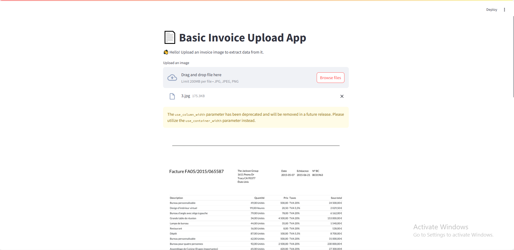

# OCR Invoice Data Extraction App (Streamlit + Gemini 2.0 Flash + LangChain)

This project extracts structured data (buyer name, invoice number, date, items, taxes, etc.) from **invoice images** using **Google Gemini 2.0 Flash**, integrated through **LangChain**.  
It includes a simple **Streamlit** web app for uploading invoices and exporting results.

---

## Streamlit interface:




## 🛠️ Built With

 - Gemini 2.0 Flash — Multimodal AI model (text + image)
 - LangChain — LLM orchestration
- Pydantic — Schema-based parsing
- Streamlit — Web interface
- Pillow (PIL) — Image processing
- Python 3.10+

##  How It Works
- User uploads an invoice image.
- The image is converted to base64.
- LangChain sends a prompt with the image and an output schema to Google Generative AI.
- The LLM extracts structured invoice data based on few-shot examples.
- The output is returned as JSON and displayed in the UI.


# Example Output
```
{
  "buyer_name": "Deco Addict",
  "Invoice_number": "FA04/2015/027662",
  "Invoice_date": "04-04-2015",
  "items": [
    {"description": "Restaurant", "Taxes": 0.2},
    {"description": "Bureau personnalisable", "Taxes": 0.2}
  ]
}
```
